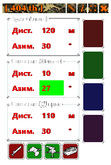

Foxhole
---
# Калькулятор артиллериста



```
Num - :  
Ввод координат противника  
  
Num + :  
Ввод координат союзников  

Num * :
Ресайз окна до 4/3, позволяющий дальше стрелять и лучше видеть

PrtScr:  
Скриншот координат с бинокля  
```

+ Квадратики справа нужны чтоб сохранять координаты точек опорных позиций.  
+ При наведении на орудие - выскакивает подсказка о его дальности.  
+ Ввод координат выполняется последовательно, с помощью нампада (сначало дистанция, затем азимут).  
+ Если дистанция или угол не трехзначные, может быть удобно вводить с лидирующими нулями, но можно и нажать любую кнопку после ввода.   
+ Если на данный момент кальк не нужен - можно "свернуть" в полосочку по стрелочкам в шапочке, чтоб не мешался.  

