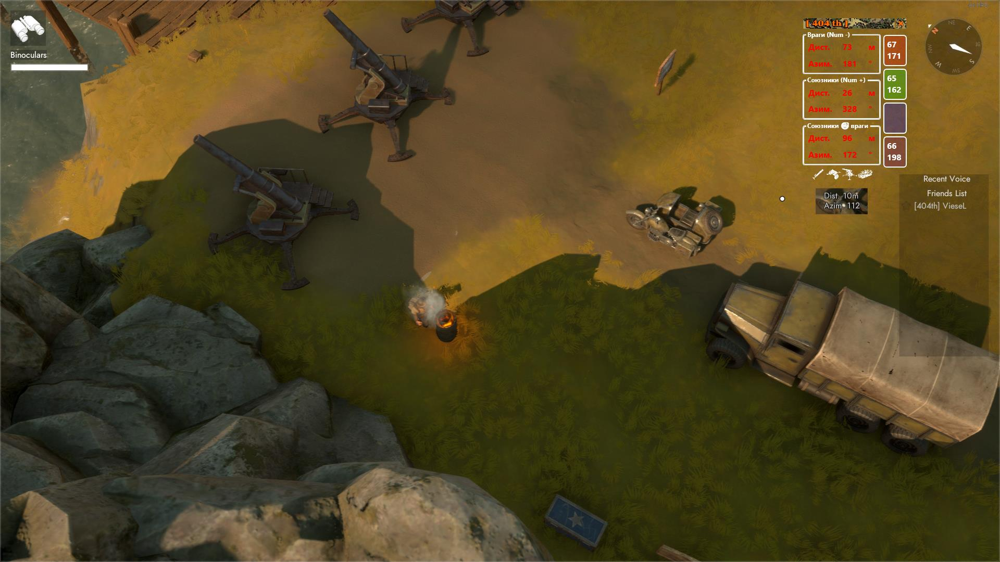
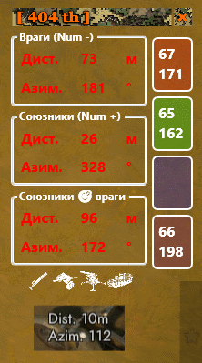

Foxhole
---
# Калькулятор артиллериста



```
Num - :  
Ввод координат противника  
  
Num + :  
Ввод координат союзников  
  
PrtScr:  
Скриншот координат  
```

+ При щелчке по боковым прямоугольникам запоминаются текущие координаты.  
+ При наведении на орудие - выскакивает подсказка о его дальности.  
+ Ввод координат выполняется последовательно, с помощью нампада (сначало дистанция, затем азимут).  
+ Если дистанция или угол не трехзначные, может быть удобно вводить с лидирующими нулями, но можно и нажать любую кнопку после ввода.  

